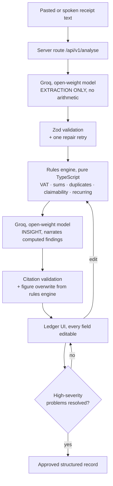

# PocketPulse

**Xero tells you what your VAT is. PocketPulse tells you which of it you are about to lose.**

Turns pasted South African receipts into a reviewed expense ledger, and tells the owner
which of their input VAT their paperwork will not support.

3Devs · Guild SA Buildathon 01 · Challenge 04 — Micro-Business Financial Workflow Assistant.

> **The model reads. The code calculates. The model explains. The human approves.**
> Every rand shown in the UI comes from the rules engine — including rands inside
> AI-written sentences.

---

## Status

🚧 **Scaffold.** Monorepo structure, config, theme, the frozen data contract (schemas),
VAT arithmetic, the synthetic data pack and both AI prompts are in place. Feature surfaces
(review ledger, overview, charts, API wiring) are stubbed and tracked in [PLAN.md](./PLAN.md).

## How to run

```bash
# from the monorepo root (pocketpulse/)
corepack enable && corepack prepare pnpm@9.0.0 --activate   # if pnpm is not installed
pnpm install
cp apps/web/.env.example apps/web/.env.local                # then fill in GROQ_API_KEY + GROQ_MODEL
pnpm dev                                                     # http://localhost:3000
pnpm test                                                    # rules-engine tests (packages/core)
```

## AI provider

- **Provider:** GroqCloud (open-weight inference, plain `fetch`, no SDK).
- **Model:** ⚠️ **TODO — confirm the exact production model ID** from the live endpoint and
  record it here (this is a hard submission requirement):
  ```bash
  curl https://api.groq.com/openai/v1/models -H "Authorization: Bearer $GROQ_API_KEY" | jq '.data[].id'
  ```
  Recommended default: `llama-3.3-70b-versatile` (open-weight, production, strong JSON).
- Configure via `apps/web/.env.local` (see `.env.example`). No variable is ever prefixed
  `NEXT_PUBLIC_`; `lib/groq.ts` starts with `import "server-only"`.

## Which calculations happen in code, not AI

VAT, line-item sums, duplicate matching, outlier detection (MAD), claimability tiers,
recurring commitments, category totals and approval gating are **all** pure TypeScript in
`packages/core`. The model only reads unstructured text and narrates findings the code
produced. See the architecture diagram below.

## How structured output is validated

Zod schemas (`packages/core/src/schemas.ts`) validate every model response, with **one**
repair retry appended on failure. Two failures makes the record `unparseable_record` —
never a third retry.

## What happens when information is missing

`null` / `unknown`, the field named in `missing_fields`, and a specific clarification
question — never an invented value. `computed_vat` is `null` (never `0`) for `unknown` /
`not_registered` status.

## What happens when the AI service fails

Every API response uses one error envelope (`{ ok, data | error }`). Partial results are
supported (nine of thirteen parse → show nine, mark four unread). A templated fallback
generates insights from the validated flags when Groq is unreachable.

## Architecture



The loop from H back to E is the human in the loop.

## Limitations (written honestly)

- Confidence is a completeness heuristic, **not** a calibrated probability.
- Duplicate detection will flag two genuine identical same-day purchases from the same
  supplier; that is deliberate — the system flags and the human decides.
- Outlier detection needs five or more records and is suppressed below that.
- Category assignment is a model judgement and will sometimes need correction.
- Only plain text input; no OCR, no PDF, no images.
- VAT logic assumes the 15% standard rate; no zero-rated or exempt supplies.
- Recurrence is read from what documents state; with one month of data we cannot detect
  double-billing across months.
- Sign-in is a demonstration gate with no backend; no authentication was built. The
  buildathon guidelines do not require authentication and we did not build any.

---

_A learning project. Not tax or accounting advice._
