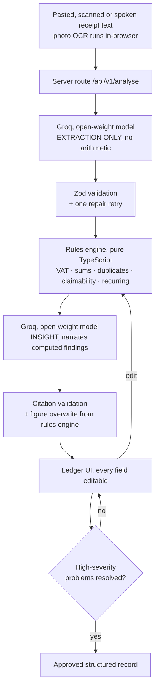

# PocketPulse

**Xero tells you what your VAT is. PocketPulse tells you which of it you are about to lose.**

Turns pasted South African receipts into a reviewed expense ledger, and tells the owner
which of their input VAT their paperwork will not support.

3Devs · Guild SA Buildathon 01 · Challenge 04 — Micro-Business Financial Workflow Assistant.

> **The model reads. The code calculates. The model explains. The human approves.**
> Every rand shown in the UI comes from the rules engine — including rands inside
> AI-written sentences.

---

## Status

✅ **Working MVP.** End-to-end flow builds and runs: demo sign-in → add/sample receipts →
AI extraction (Groq) + deterministic rules engine → editable review ledger with live
recompute, evidence drawer, duplicate handling and approval gating → overview, paperwork,
repeating and approved screens → CSV export. Core rules engine: **34 tests passing**,
reproducing every §7.4 figure. Built-in samples run the rules engine in-browser, so the
demo works even without an API key. Remaining polish is tracked in [PLAN.md](./PLAN.md).

## How to run

```bash
# from the monorepo root (pocketpulse/)
corepack enable && corepack prepare pnpm@9.0.0 --activate   # if pnpm is not installed
pnpm install
cp apps/web/.env.example apps/web/.env.local                # then fill in GROQ_API_KEY + GROQ_MODEL
pnpm dev                                                     # http://localhost:3000
pnpm test                                                    # rules-engine tests (packages/core)
```

## Deploy (Vercel, from this monorepo)

Repo: <https://github.com/wemakesites-lama/pocketpulse>

1. <https://vercel.com/new> → **Import** the `pocketpulse` repo.
2. **Root Directory:** `apps/web`.
3. Expand **Root Directory** settings → turn **ON** "Include files outside of the Root
   Directory in the Build Step" (without this, `packages/core` is not uploaded and the
   build fails on the first core import).
4. Framework preset: **Next.js** (auto). Install/Build commands: **auto** (Vercel detects
   pnpm workspaces).
5. **Environment Variables** (Production + Preview) — optional; the built-in samples run
   the rules engine in-browser and work without any key. Needed only for the paste path:
   - `GROQ_API_KEY` = your key
   - `GROQ_MODEL` = the exact production model id from `/models` (e.g. `llama-3.3-70b-versatile`)
   - `GROQ_BASE_URL` = `https://api.groq.com/openai/v1`
   - `APP_ORIGIN` = your deployed origin (locks CORS in production)
6. **Deploy.**

_Alternative for hosts that can't build a pnpm workspace:_ `bash scripts/make-standalone.sh`
produces a self-contained Next app (core folded in, imports unchanged) you can deploy directly.

## AI provider

- **Provider:** GroqCloud (open-weight inference, plain `fetch`, no SDK).
- **Model:** ⚠️ **TODO — confirm the exact production model ID** from the live endpoint and
  record it here (this is a hard submission requirement):
  ```bash
  curl https://api.groq.com/openai/v1/models -H "Authorization: Bearer $GROQ_API_KEY" | jq '.data[].id'
  ```
  Recommended default: `llama-3.3-70b-versatile` (open-weight, production, strong JSON).
- Configure via `apps/web/.env.local` (see `.env.example`). No variable is ever prefixed
  `NEXT_PUBLIC_`; `lib/groq.ts` starts with `import "server-only"`.

## Which calculations happen in code, not AI

VAT, line-item sums, duplicate matching, outlier detection (MAD), claimability tiers,
recurring commitments, category totals and approval gating are **all** pure TypeScript in
`packages/core`. The model only reads unstructured text and narrates findings the code
produced. See the architecture diagram below.

## How structured output is validated

Zod schemas (`packages/core/src/schemas.ts`) validate every model response, with **one**
repair retry appended on failure. Two failures makes the record `unparseable_record` —
never a third retry.

## What happens when information is missing

`null` / `unknown`, the field named in `missing_fields`, and a specific clarification
question — never an invented value. `computed_vat` is `null` (never `0`) for `unknown` /
`not_registered` status.

## What happens when the AI service fails

Every API response uses one error envelope (`{ ok, data | error }`). Partial results are
supported (nine of thirteen parse → show nine, mark four unread). A templated fallback
generates insights from the validated flags when Groq is unreachable.

## Architecture



The loop from H back to E is the human in the loop.

## Limitations (written honestly)

- Confidence is a completeness heuristic, **not** a calibrated probability.
- Duplicate detection will flag two genuine identical same-day purchases from the same
  supplier; that is deliberate — the system flags and the human decides.
- Outlier detection needs five or more records and is suppressed below that.
- Category assignment is a model judgement and will sometimes need correction.
- Input is text, photo or voice. Photo scanning runs OCR **in the browser** (Tesseract.js,
  printed **English** only — the image never leaves the device); voice is transcribed via
  Groq Whisper. No PDF import.
- VAT logic assumes the 15% standard rate; no zero-rated or exempt supplies.
- Recurrence is read from what documents state; with one month of data we cannot detect
  double-billing across months.
- **Auth & persistence (added beyond the buildathon spec, at the owner's request):**
  sign-in is passwordless **email OTP via Supabase**, and each user's batches persist in a
  Postgres `batches` table (RLS-protected) instead of `localStorage`. On the Supabase free
  tier with the default email provider the message delivers a **magic link** (click to sign
  in); a true **6-digit code** needs custom SMTP (e.g. Resend) — the login UI supports both.
  Built-in sample analysis still runs in-browser and works without any key. If a Supabase
  env is absent, the app falls back to the localStorage demo gate.

---

_A learning project. Not tax or accounting advice._
